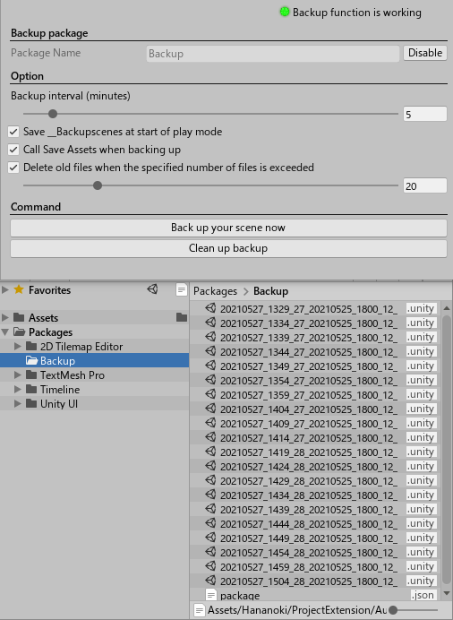

# Auto Backup


[Japanese](https://translate.google.com/translate?sl=en&tl=ja&u=https://github.com/hananoki/AutoBackup) (by Google Translate)

## Overview
- Automatically save scenes on a regular basis

  

## Installation
- Add following lines to the `dependencies` section of the `Packages/manifest.json`.
```js
"dependencies": {
  "com.hananoki.auto-backup": "https://github.com/hananoki/AutoBackup.git",
  "com.hananoki.shared-module": "https://github.com/hananoki/SharedModule.git",
  ...
}
```

## Licence
[MIT](https://github.com/hananoki/CustomHierarchy/blob/master/LICENSE.md)
